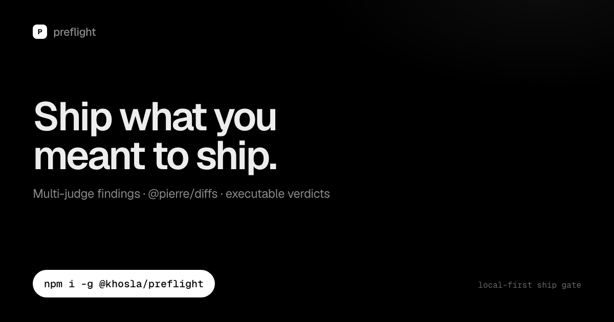

# preflight

> After your coding agent finishes, run one command.

Local ship gate for agent-built software.

```sh
npx @khosla/preflight
```

That’s the whole start. Browser opens with what changed + findings.  
Exit **0** = approved · **2** = fix findings · **1** = error.

<p align="center">
  
</p>

## Get value in seconds

1. **Have a dirty git repo** (or a branch range)
2. **Have an agent CLI** on PATH: `pi`, `claude`, `codex`, `amp`, `opencode`, or `gemini`  
   (optional: `ANTHROPIC_API_KEY`)
3. **Run**
   ```sh
   npx @khosla/preflight
   ```

Agent / CI mode:

```sh
npx @khosla/preflight --json --auto
```

Check setup:

```sh
npx @khosla/preflight doctor
```

## Optional global install

```sh
npm i -g @khosla/preflight
preflight
```

## What it does

1. Reads your git diff (or stdin)
2. Packs local context (intent, symbols/tests, optional verify + memory)
3. Judges with your agent CLI (multi-judge when 2+ CLIs available)
4. Opens a review UI **or** prints JSON for agents
5. Returns approve / changes-requested

## Agent snippet

```text
After a non-trivial change, run:
  npx @khosla/preflight --json --auto
- exit 0 → continue
- exit 2 → fix each open finding by id, re-run
```

## Common flags

| Flag | Meaning |
|---|---|
| `--json --auto` | Headless agent mode |
| `--strict` / `--no-strict` | Force / disable multi-judge |
| `--with pi,codex` | Choose backends |
| `--no-verify` | Skip local tsc/tests |
| `--no-delta` | Ignore prior review state |

## Links

- Site: https://gvkhosla.github.io/preflight/
- UI mock: https://gvkhosla.github.io/preflight/demo-ui.html
- GitHub: https://github.com/gvkhosla/preflight
- npm: https://www.npmjs.com/package/@khosla/preflight

## Develop

```sh
bun install && bun test && bun run build
```

## Credits

Diff snippets in the review UI are rendered with [`@pierre/diffs`](https://www.npmjs.com/package/@pierre/diffs).

## License

MIT © Geet Khosla
